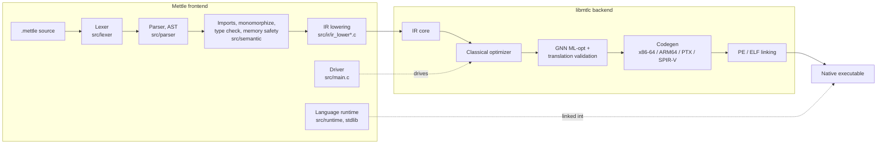

# Mettle and libmtlc

Mettle is a frontend. It owns the language: lexing, parsing, type checking,
memory safety analysis, monomorphization, and lowering to IR. Everything after
that IR exists is libmtlc: the optimizers, code generation for x86-64 /
ARM64 / PTX / SPIR-V, and native PE and ELF linking.

They are two halves of one toolchain and they live in one repository. The
boundary between them is real and enforced by the build, not by a repository
split.



## What each side owns

| Frontend | libmtlc |
|--|--|
| `src/lexer`, `src/parser`, `src/semantic` | `src/ir` (core), `src/ir/optimizer` |
| `src/ir/ir_lower*.c` (AST to IR) | `src/codegen`, `src/linker` |
| `src/frontend` (frontend type to `MtlcType`) | `src/compiler`, `src/debug` |
| `src/main.c` (the driver) | `src/common.c`, `src/error/error_reporter.c` |
| `src/error/error_explain.c` (`--explain` output) | `src/mtlc_*.c` (the public API) |
| `src/runtime`, `stdlib` | `include/mtlc` |

`src/error` splits because the two files do different jobs: the diagnostics
reporter renders against raw source text and a `SourceLocation` with no AST, so
libmtlc's compile-time interpreter reports through it and owns it. The
`--explain` renderer is Mettle's own optimization report.

The Makefile is where that boundary is written down. `BACKEND_SOURCES` and
`FRONTEND_SOURCES` are two disjoint lists, and the backend list is what goes
into the archive. Adding a translation unit means deciding which list it joins.

## Is libmtlc still a separate artifact?

Yes. Living in this repository changed how it is *developed*, not how it is
*consumed*. Every release attaches a backend-only asset,
`libmtlc-<tag>-<target>.zip` on Windows and `.tar.gz` on Linux, carrying the
`include/mtlc/` headers, the static archive, and the freestanding runtime
object. Nothing in it is Mettle-specific and nothing in it needs this
repository.

```bash
# Linux
curl -fsSL https://raw.githubusercontent.com/suidvandiewereld/Mettle/main/get-libmtlc.sh | sh
```

```powershell
# Windows
irm https://raw.githubusercontent.com/suidvandiewereld/Mettle/main/get-libmtlc.ps1 | iex
```

Both accept `LIBMTLC_VERSION` to pin a tag and `LIBMTLC_DIR` to choose where it
lands. From a checkout, `make install-libmtlc` does a system install with a
pkg-config file, so a consumer builds with
`cc $(pkg-config --cflags --libs libmtlc) app.c` and never mentions Mettle.

What did change: libmtlc is no longer a separately versioned dependency of
this repository. There used to be a `libmtlc.version` pin here and a fetch step
that pulled a matching build; both are gone, and the backend is compiled from
`src/` along with everything else. So the two versions are no longer
independent. The toolchain carries the release version, and the backend reports
its own API version through `mtlc_version()`, currently `libmtlc 0.2.0`, which
is what a pkg-config `Requires:` should be written against.

For an adopter the practical consequences are:

- The asset still exists at every release and the fetchers still work.
- The public surface is still `include/mtlc/`, unchanged by the merge.
- The API version moves on its own schedule and is not the toolchain version.
- Its self-containment is enforced per build, not assumed: see below.

## Building the backend alone

```powershell
.\build.bat --backend-only    # bin\mtlc.lib
```

```bash
make libmtlc                  # bin/libmtlc.a
make install-libmtlc          # headers + archive + libmtlc.pc
make dist-libmtlc             # staged into dist/libmtlc, no root needed
```

That archive is the whole point of keeping the line clean: it carries no
frontend at all, and any frontend that lowers into the IR can drive it.
[`examples/calc`](../examples/calc) is a small non-Mettle frontend that does
exactly that, through the public API alone.

The build checks this rather than trusting it. After archiving, it relocatably
links the archive and fails if a single non-OS symbol is left unresolved. It is a
backend that had picked up a frontend dependency would not survive that.

## Why the driver is not a normal consumer

libmtlc's public surface is `include/mtlc/`: build IR through `mtlc/build.h`,
run it through `mtlc/pipeline.h`, touch nothing else. `examples/calc` is that
consumer.

Mettle's driver is not. It reaches past the public API into the backend's own
headers, because it drives machinery the public surface does not expose:

| Driver feature | Backend header it needs |
|--|--|
| `--explain`, `--explain-json` optimization reports | `ir/ir_optimize.h`, `ir/ir_explain_memory.h` |
| `--pgo` profile-guided optimization | `ir/ir_profile.h`, `ir/ir_pgo.h` |
| `--ml-opt` statistics and dispositions | `ir/ml_opt.h` |
| `--verify` per-pass translation validation | `ir/ir_verify.h` |
| `--debug-hooks` breakpoint and variable hooks | `ir/ir_debug_hooks.h` |
| MIR-level annotation for `-S` output | `codegen/binary/mir_annotate.h` |
| Direct object, ARM64, PTX and SPIR-V emission | `codegen/binary_emitter.h`, `codegen/binary/arm64_ir.h`, `codegen/ptx_emitter.h`, `codegen/spirv_emitter.h` |
| The internal PE linker and startup synthesis | `linker/pe_emitter.h`, `codegen/binary/startup.h` |
| Compile-time interpreter, ICE reporting | `ir/ir_comptime.h`, `compiler/compiler_context.h`, `compiler/compiler_crash.h` |

Twenty-eight backend headers in total; a published bundle ships twelve.

That coupling is the reason the two halves share a repository. Split across two,
the driver's header set and the archive beside it drift, and a mismatched struct
layout is a crash at runtime rather than an error at compile time. Together,
they come from the same commit by construction.

Narrowing the driver onto `include/mtlc/` alone would be a real improvement, and
it is not what this repository does today.

## The include path

The build compiles with:

```
-Isrc -Iinclude
```

Every header in the tree resolves through those two. A frontend file reaching a
backend header and a backend file reaching another backend header both work,
because `src` is on the path.

One wart, from the years these halves spent in separate repositories: the tree
carries two spellings of the same include. Backend files mostly use a relative
form, `#include "../ir/ir.h"`, and frontend files mostly use the include-path
form, `#include "ir/ir.h"`. Both resolve to `src/ir/ir.h` and both compile.
Normalizing on the include-path form is a mechanical cleanup nobody has done
yet.
