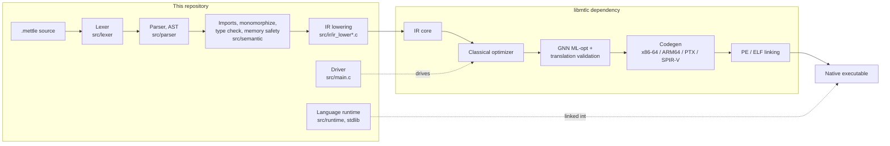

# Mettle and libmtlc

Mettle is a frontend. It owns the language: lexing, parsing, type checking,
memory safety analysis, monomorphization, and lowering to IR. Everything after
that IR exists is [**libmtlc**](https://github.com/The-Mettle-Project/libmtlc),
a separate project: the optimizers, code generation for x86-64 / ARM64 / PTX /
SPIR-V, and native PE and ELF linking.

This repository does not contain a backend. It fetches one.



## Why the split

The two halves are developed together in the libmtlc monorepo, which carries the
backend and the reference Mettle frontend side by side. That is where the
day-to-day work happens. This repository is the Mettle product: the language,
its compiler, the standard library, the docs, the examples, the installer and
the editor tooling, with the backend as a versioned dependency.

The practical consequence is that **libmtlc is upstream**. A backend change
lands there and arrives here on the next sync and version bump.

## Getting the dependency

`libmtlc.version` pins a revision. The fetchers read it, download that revision
of the libmtlc source, unpack it into `libmtlc/`, and build the static archive:

```bash
./get-libmtlc.sh          # Linux, macOS
```

```powershell
.\get-libmtlc.ps1         # Windows
```

`libmtlc/` is gitignored. Nothing about the backend is committed here except the
pinned revision.

Overrides, on both fetchers:

| | |
|--|--|
| `LIBMTLC_VERSION` | build against a different tag, branch or commit than the pin |
| `LIBMTLC_DIR` | use a libmtlc checkout you already have, instead of downloading |
| `LIBMTLC_SKIP_BUILD` / `-SkipBuild` | download only |
| `LIBMTLC_FORCE` / `-Force` | re-download and rebuild |

`LIBMTLC_DIR` is the one to reach for when working on both halves at once. A
directory with a `.git` in it is treated as yours and never overwritten:

```bash
make LIBMTLC_DIR=../libmtlc
```

```powershell
$env:LIBMTLC_DIR = "..\libmtlc"; .\build.bat
```

## Why a source dependency, and not the released library

libmtlc publishes a prebuilt backend bundle: the public API in `include/mtlc/`
plus a static library. That bundle is aimed at a *foreign* frontend, one that
builds IR through `mtlc/build.h` and drives it through `mtlc/pipeline.h` and
touches nothing else. [`examples/calc`](https://github.com/The-Mettle-Project/libmtlc/tree/main/examples/calc)
in the libmtlc repository is exactly that.

Mettle's driver is not that. It reaches past the public API into the backend's
own headers, because it drives machinery the public surface does not expose:

| Driver feature | Backend header it needs |
|--|--|
| `--explain`, `--explain-json` optimization reports | `ir/ir_optimize.h`, `ir/ir_explain_memory.h` |
| `--pgo` profile-guided optimization | `ir/ir_profile.h`, `ir/ir_pgo.h` |
| `--ml-opt` statistics and dispositions | `ir/ml_opt.h` |
| `--verify` per-pass translation validation | `ir/ir_verify.h` |
| `--debug-hooks` breakpoint and variable hooks | `ir/ir_debug_hooks.h` |
| MIR-level annotation for `-S` output | `codegen/binary/mir_annotate.h` |
| Direct object, ARM64, PTX and SPIR-V emission | `codegen/binary_emitter.h`, `codegen/binary/arm64_ir.h`, `codegen/ptx_emitter.h`, `codegen/spirv_emitter.h` |
| The internal PE linker and startup synthesis | `linker/pe_emitter.h`, `codegen/binary/startup.h` |
| Compile-time interpreter, ICE reporting | `ir/ir_comptime.h`, `compiler/compiler_context.h`, `compiler/compiler_crash.h` |

Twenty-eight backend headers in total. A prebuilt bundle ships twelve.

So Mettle takes libmtlc as **source**, pinned to one revision, and builds the
archive from it. Headers and library then come from the same commit by
construction, which is the failure this arrangement is chosen to avoid: a
vendored header set that has drifted from the library beside it produces a
crash at a struct-layout boundary, not a compile error.

Mettle is a tightly coupled first-party frontend, and this file is the record of
that. Narrowing the driver onto `include/mtlc/` alone would be a real
improvement, and it is not what this repository does today.

## The include path

The build compiles with, in this order:

```
-Isrc -Ilibmtlc/include -Ilibmtlc/src
```

`-Isrc` is first and that ordering matters. libmtlc's tree carries its own copy
of the reference frontend, so `libmtlc/src/parser/ast.h` exists too; putting our
`src` ahead of it means this repository's headers always win, and only the
backend headers we do not have fall through to the dependency.

For that to work, a frontend source file cannot reach a backend header with a
relative path. `#include "../ir/ir.h"` resolves against the including file's own
directory, which here is ours, not libmtlc's. So every such include is written
in include-path form:

```c
#include "ir/ir.h"          /* libmtlc/src/ir/ir.h        */
#include "common.h"         /* libmtlc/src/common.h       */
#include "mtlc/type.h"      /* libmtlc/include/mtlc/type.h */
#include "symbol_table.h"   /* ours, same directory        */
```

`tools/sync-from-libmtlc.ps1` applies that rewrite automatically. It is the only
source difference between the frontend here and the frontend in libmtlc's tree.

## Syncing from upstream

```powershell
.\tools\sync-from-libmtlc.ps1 -LibmtlcDir ..\libmtlc
```

The script copies the Mettle half out of a libmtlc checkout, rewrites the
includes, and skips the backend. Its file lists *are* the frontend/backend
boundary in executable form: a new frontend translation unit in libmtlc has to
be added to `$FrontendFiles` before it will appear here.

Two things it deliberately leaves alone:

- **`tests/run_tests.ps1`** is repo-local. It takes a `-LibmtlcDir`, points the
  handful of harnesses that compile backend translation units at the dependency,
  and drops libmtlc's own boundary audits. New upstream cases are ported by
  hand; the script prints a reminder with both line counts.
- **`Makefile`, `build.bat`, `install.*`, `README.md`** are this repository's
  own, because they build a frontend against a dependency rather than a monorepo.

After a sync, move the pin in `libmtlc.version` to match, then rebuild:

```powershell
.\get-libmtlc.ps1
.\build.bat
```

## What each side owns

| This repository | libmtlc |
|--|--|
| `src/lexer`, `src/parser`, `src/semantic` | `src/ir` (core), `src/ir/optimizer` |
| `src/ir/ir_lower*.c` (AST to IR) | `src/codegen`, `src/linker` |
| `src/frontend` (frontend type to `MtlcType`) | `src/compiler`, `src/debug` |
| `src/main.c` (the driver), `src/mettle_alloc.c` | `src/common.c`, `src/error/error_reporter.c` |
| `src/error/error_explain.c` (`--explain` output) | `src/mtlc_*.c` (the public API) |
| `src/runtime`, `stdlib` | `include/mtlc` |

`src/error` splits because the two files do different jobs: the diagnostics
reporter renders against raw source text and a `SourceLocation` with no AST, so
libmtlc's compile-time interpreter reports through it and owns it. The
`--explain` renderer is Mettle's own optimization report.

## Building without the network

`get-libmtlc.sh` and `get-libmtlc.ps1` are the only steps that need network
access, and only when the pinned revision is not already unpacked. With
`libmtlc/` populated, or `LIBMTLC_DIR` pointed at a checkout, `make` and
`build.bat` are entirely offline.
