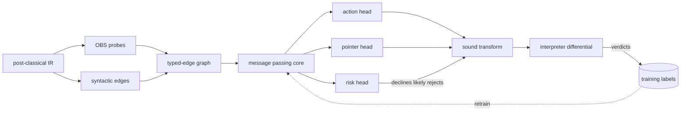

# gnn_oracle: semantic node identity and a validator-trained optimizer

This is the design document for the successor to the `--ml-opt` model described
in [`ml-opt.md`](ml-opt.md). That document describes what ships today. This one
describes what is being built and why. The bake-off results it refers to are
produced by the harness in [`tools/mlopt`](../tools/mlopt) and are not checked in.

The shipped model (`gnn_genius`) is a relational GNN over the IR dataflow graph:
one node per instruction, eight typed edges, nine scalar node features, six
action classes, d=384, 8 layers, ~10.8M parameters. It works, it is verifier
gated, and it has a specific set of ceilings. `gnn_oracle` addresses four of
them, each as an independently ablatable change.

## What is actually new here

Two claims, and they depend on each other:

1. **Node identity by observational equivalence, computed identically in the
   training harness and in the compiler.** Compiler GNNs represent an
   instruction by its opcode and its neighbours. This one additionally represents
   it by *what it computes*: a fingerprint from evaluating the instruction on
   eight pseudo-random assignments to the function's leaves. On real IR that
   finds twice as many dominating reuse candidates as expression-string matching,
   and half of them have no syntactic edge at all. Making it real rather than a
   research artifact meant pinning a PRNG, a name hash, a projection matrix, and
   uint64 evaluation semantics across Python and C, with golden vectors and a
   regression test that fails the build on divergence.

   The strongest evidence for this one needs no model at all. Feeding those
   semantic-only candidates straight to the interpreter gate across 429 compiled
   programs: of the 112 proposals the gate could rule on, **111 were validated as
   behaviour-preserving and 1 was rejected**, and the 47 affected programs all
   produce byte-identical output when actually run. Not one of the 405 proposals
   overlapped a rewrite the shipped pass already makes. Those are sound
   optimizations that survived the classical optimizer and that the shipped
   model's graph cannot represent.

2. **The translation-validation gate is a labelling oracle.** The pass already
   executes every proposed rewrite through a reference interpreter against a
   pre-rewrite snapshot. That machinery, built to keep an untrusted model honest,
   also produces free supervised labels on real code: validated proposals are
   positives, rejected ones are hard negatives with counterexamples. Nothing was
   consuming it. This is what makes training on real IR possible at all here --
   the alternative is hand-labelling, and the shipped model was trained almost
   entirely on synthetic functions because of it.

   On the shape-key held-out split this looked like a large win. It was not, and
   the correction is the most important thing in this document. See
   [Where this fails](#where-this-fails-out-of-distribution) below. The
   held-out split separates function bodies within one codebase; it does not
   separate codebases, and the delete-precision result turned out to be fitted to
   the corpus the labels came from.

   | | shape-key held-out<br>(40 toolchain programs) | MettleWarband<br>(unseen codebase) |
   |---|---|---|
   | `gnn_genius` reject rate | 59.1% | 11.4% |
   | `oracle_C` reject rate | 3.0% | 11.4% |
   | `gnn_genius` validated | 72 | 895 |
   | `oracle_C` validated | 65 | 326 |

   What survives is narrower and worth stating exactly: the gate is still the only
   reason real-IR labels exist at all, and semantic features generalize better
   than data-fitting alone (on Warband `oracle_C` finds 65% more sound deletes
   than `oracle_A`, which has the same architecture as the shipped model and only
   the new data). What does not survive is the precision claim.

   One sub-claim has to be retired before it is made, though. The obvious
   headline, "the model predicts which of its own proposals the validator will
   reject", does not survive its own control. Predicting rejection from the
   **instruction kind alone**, ten empirical rates fitted on train and applied to
   held-out, scores **0.963 AUC** (`risk_baseline.py`). Stores in
   `mem_copy`-shaped code are nearly always rejected, and that single fact
   carries most of the signal. A risk head is only interesting if it clears that
   by a wide margin, and it should be described as instruction-type prediction
   until it does.

   And then it turns out not to matter. With the action head trained on the same
   verdicts, the risk head declines nothing at any threshold: the proposals it
   would have filtered are no longer made. Fixing the proposer beat filtering it,
   which is a more useful result than the filter would have been.

The dependency is the interesting part. Fingerprint agreement over eight probes
is evidence of value equality, not proof, so no sound static analysis in this
codebase can license a rewrite on that basis. The only thing that can license it
is the gate. Semantic candidate generation and validator-derived supervision are
not two independent ideas that happen to share a model; neither is much use here
without the other.

A third idea, **adaptive depth**, was tried and did not work. Replacing eight
fixed layers with one shared block plus a learned halting scalar cut parameters
from 10.8M to 3.3M, and cost accuracy across the board: held-out GVN F1 0.636
against 0.845-0.889, risk AUC 0.970 against 0.988-0.996, barely clear of the
0.963 kind-only baseline. Worse, it ran 13.3 halting steps in training against
the baseline's 8 fixed layers, so it traded parameters for *more* compute and
~2x slower epochs; the 0.01 ponder penalty was far too weak to buy halting.

One confound, stated rather than buried: being slower, it hit the 100-minute
wall-clock budget at ~22 epochs where the others ran 30, so some of the gap is
undertraining. The gap is wide enough that undertraining is unlikely to explain
all of it, but a matched-epoch rerun would be needed to say so. The premise was
wrong either way, parameter count is not what the compile-time bill is
denominated in.

## Where this fails: out of distribution

Everything measured on the shape-key held-out split was measured on one codebase:
the toolchain's own tests, examples, and stdlib. That split stops a function body
appearing on both sides. It does not stop a model learning one project's idioms
and being scored on the same project's idioms.

MettleWarband is the first evaluation from outside that distribution, 17 441
lines, 18 modules, a Vulkan renderer with networking and AI, 863 functions in the
post-classical IR, in a different repository that was never harvested.
`dist_overlap.py` puts a number on the difference:

| | shape-key held-out set | MettleWarband |
|---|---|---|
| exact shape-key match in training | 0% by construction | 9.6% (linked stdlib) |
| median max shape similarity | 0.529 | **0.333** |
| functions >= 0.7 similar | 29.3% | **11.2%** |

Speculative `DELETE`, whole-program build, counting the gate's verdicts:

| model | proposals | validated | rejected | reject rate |
|---|---|---|---|---|
| `gnn_genius` (shipped) | 27 776 | **895** | 115 | 11.4% |
| `oracle_A` (new data, shipped architecture) | 592 | 197 | 28 | 12.4% |
| `oracle_C` (+ semantic + pointer) | 1 129 | 326 | 42 | 11.4% |

Three readings, in order of importance:

1. **The precision advantage is gone.** All three models sit at 11-12%. The
   twentyfold reduction measured on the held-out split does not exist here for
   any variant. It was distribution-fitting.
2. **Recall is worse, and the shipped model wins.** 895 against 326 and 197. A
   model trained on these labels is a regression on code from outside the corpus.
3. **Semantic features are the part that partially generalizes.** `oracle_C`
   finds 65% more than `oracle_A` at identical precision. `oracle_A` memorized
   which sites in the toolchain get rejected and went quiet on unfamiliar code;
   `oracle_C`'s node identity is structural, so it kept proposing. That ordering
   is the clearest evidence the architecture does something the data alone does
   not. It just does not do enough to beat the shipped model.

The model-free path is the one that holds up. On the same unseen codebase,
`sem_probe.py` proposes 820 semantic-only reuse candidates, none overlapping the
shipped pass, and the gate validates **103 against 17 rejections**, more sound
rewrites in one application than the 111 found across roughly 500 toolchain
programs. Precision falls out of distribution (14.2% rejected against 0.9%),
which is exactly what eight probes of evidence should do on unfamiliar code, and
the gate catches every one of them.

The general lesson, which applies to any learned compiler pass: **a held-out
split within one codebase measures memorization of that codebase's idioms.**
Report the distribution distance alongside the held-out number, or the held-out
number will be believed for more than it is worth.

## The four ceilings

### 1. The model reasons about program text

A node's identity is its kind, its operator, and nine flags. Two instructions are
linked as equivalent only when their expression strings match after commutative
operands are sorted. So `(a + b)` and `(b + a)` link, but `x * 2`, `x + x`, and
`x << 1` are three unrelated nodes.

Every value-level question the model is asked is a semantic question answered
from syntax:

| action | the question | what the model can see |
|---|---|---|
| `FOLD` | is this a compile-time constant? | operand literal flags |
| `COLLAPSE` | does this tangle equal an in-scope leaf? | nothing direct |
| `GVN` | does this recompute a dominating temp? | string equality of the expression |

### 2. The head is less informative than the decision

`GVN` means "reuse a dominating temp that computes this same value". The model
emits the label `GVN` and nothing else; `ml_gnn.c` then re-derives which temp on
its own. The model is not permitted to say the only thing that matters.

### 3. Fixed depth is a fixed receptive field

Eight message-passing layers are applied identically to a 6-node leaf function
and a 400-node loop nest. Short functions pay for depth they do not need, and
liveness across a long dependence chain cannot propagate far enough. The
per-layer message matrices are also the bulk of the parameters: eight layers of
eight edge types at d=384 is 9.4M of the 10.8M total, and the shipped weight blob
is 42MB.

### 4. The oracle's verdicts were discarded

Every speculative proposal is executed through the reference interpreter against
a pre-rewrite snapshot. Proposals that survive are sound rewrites on real code;
proposals that diverge are hard negatives with a counterexample attached. Across
the benchmark suite roughly 45% of speculative proposals are rejected. None of
that signal was used for anything. Meanwhile the model was trained almost
entirely on synthetic functions.

## The architecture



The dashed edge is the point of the design: the gate that keeps the model honest
at compile time is also the thing that teaches it.

### OBS: observational-equivalence node features

Each pure instruction is evaluated on `NPROBE = 8` deterministic pseudo-random
assignments to the function's leaves. The resulting 8 x 64 bits are the node's
fingerprint. A frozen +-1 random projection (SimHash) reduces those 512 bits to
32 bounded floats, so equal values give equal features and near-equal values give
near features. Four derived scalars come along: `is_const`, `eq_leaf`, `eq_zero`,
and `dup_earlier`. Node features go from 9 to 45.

Two new edge types link nodes with identical fingerprints, and two more link the
dominating cases, mirroring the existing syntactic same-expr and
dominating-same-expr edges. Edge types go from 8 to 12.

The probe set is deliberately mixed, and getting this wrong is the main way the
idea fails:

| probe | leaf values | why |
|---|---|---|
| 0 | all 0 | `x == y` is 1 here and the literal `0` is not |
| 1 | all 1 | equality can never be confused with zero |
| 2 to 4 | small, mod 4 | orderings and divisions actually vary |
| 5 to 7 | full 64-bit | discriminating power against false positives |

Uniform 64-bit leaves alone do not work. Two random 64-bit values are never
equal and never ordered close, so every comparison evaluates to 0 on every probe
and `x == y`, `x < y`, and the constant `0` collapse to one fingerprint. The wide
probes are what keep false positives away: unrelated values may agree on the
degenerate probes but must then also agree on three full-width probes.

Three classes of node are held opaque rather than fingerprinted, because
straight-line evaluation would lie about them:

- names defined more than once, since a scan cannot model a loop back edge and
  would report a loop counter as its initializer forever,
- names passed to a call or touched by a store, since a callee writing through a
  pointer is invisible to a def-only scan,
- call results and loads, keyed per instruction so two calls never alias.

Constant- and boolean-valued nodes keep their features but are withheld from the
value edges. Constants would wire every literal into a clique and hand the graph
hub nodes whose mean-aggregated messages swamp real dataflow, and rematerializing
a literal is not a saving anyway. Booleans carry one bit, so unrelated
comparisons collide no matter how the probes are chosen; that is a property of
the output domain rather than a fixable bug, and claiming those as semantic
matches would be dishonest. Genuinely identical comparisons are still linked by
the syntactic edge, which is exact for them.

**This is a feature, never a proof.** Fingerprint agreement is evidence of value
equality. The interpreter gate remains the sole authority on whether any proposal
is sound, exactly as it is today.

#### How much does syntax actually miss?

Measured over all real IR harvested from the repository, counting dominating
pairs that a sound GVN would consider (`tools/mlopt/obs_gap.py`):

```
real IR: 3222 unique function bodies, 175222 instructions
  syntactic pairs, all nodes       : 5531   (what the shipped model is handed)
  --- like for like, on the nodes eligible for a value edge ---
  syntactic pairs                  : 1675
  semantic  pairs                  : 3292
  semantic-only (the gap)          : 1723  (52.3% of semantic pairs)
  functions containing a gap pair  : 419/3222 (13.0%)
```

On the same population of nodes, semantic identity finds **just under twice** as
many dominating reuse candidates as syntactic identity (3292 against 1675), and
over half of them have no syntactic edge at all.

The two-population caveat matters and is why the numbers are reported this way.
The semantic side excludes constant- and boolean-valued nodes; the shipped
model's syntactic edge does not. Comparing 3292 against the unfiltered 5531 would
suggest the semantic edge finds *fewer* pairs, which is an artifact of measuring
two different node sets rather than a fact about either.

The most interesting matches are not copies:

```
%t9 = @buf + %t8            ~=  %t16 = @buf + %t15
```

Two address computations that are equal because `%t8` and `%t15` are themselves
equal by different routes. No expression-key edge can see that.

#### Are they real? Ask the validator, with no model involved

A candidate is not a rewrite, so counting candidates proves nothing on its own.
`sem_probe.py` settles it end to end and without any network: compile with
`--ml-opt` to get the post-classical IR, compute the semantic-only dominating
pairs on exactly that IR, emit each as a `COPY` disposition, and recompile with
`METTLE_ML_DISP` so those proposals (and nothing else) go through the
interpreter differential.

```
semantic-only reuse candidates, adjudicated by the interpreter gate
  sources compiled     : 424
  proposed             : 232
  reached the gate     : 232
  VALIDATED equivalent : 99
  REJECTED             : 1
  proven-only          : 0
  skipped (declined / function unverifiable): 132
  of the 100 the gate actually ruled on: 99.0% validated
```

Every one of these proposals sits at an instruction the shipped `--ml-opt` pass
does not touch. That is checked, not assumed: the probe reads the pass's own
disposition file for the same program and drops any proposal that overlaps it.
Across 429 compiled sources the overlap is **0**.

**Of the 112 proposals the interpreter could rule on, 111 were confirmed
behaviour-preserving and 1 was rejected.** Every validated row survived the
classical optimizer, has no syntactic GVN edge, and changes the emitted binary.
The single rejection matters as much as the 99: it is the gate doing its job
rather than rubber-stamping, which is exactly why fingerprint agreement is
treated as evidence and never as a licence.

Extending the same probe to the deeper real code (the `ornith` LLM engine,
`lib/`, `tools/`) adds 173 proposals, of which the gate ruled on 12 and validated
all 12. Combined across both runs: **405 proposed, 112 adjudicated, 111
validated, 1 rejected, 0 applied unadjudicated.**

On magnitude, honestly: 111 rewrites across roughly 500 programs is about one
validated rewrite per five programs, not a transformative win. The classical
optimizer is good and most of this redundancy is already gone. What is new is the
*class* (these are cases no syntactic analysis in the pipeline can see), not
the volume.

Nothing was applied without adjudication. Reaching that state required a fix to
the pass itself, described next, the first run of this probe silently applied
116 rows unvalidated.

#### A soundness gap the pointer head would walk straight into

`ml_opt.c` decides what is unproven with one predicate:

```c
static int disp_speculative(const MLDisp *d) { return d->kind == MLK_NOP; }
```

So only `NOP` (speculative dead-code deletion) is treated as needing the gate's
word. `COPY`, `CONST`, and `REWRITE` are considered sound by construction, and
when the interpreter cannot execute a function they are applied *unvalidated* and
reported as `proven`.

That was correct as long as every `COPY` came from the available-expressions plus
dominance analysis in `ml_gnn.c`, which really is sound by construction. The probe
above quietly violated the assumption: its `COPY` dispositions carry no proof at
all, and 116 of them were applied without adjudication as a result.

**The PTR variant would violate it by design.** A pointer head that names its own
reuse target emits a `COPY` whose source a neural network chose, and the old
predicate would let that through unvalidated on any function the interpreter
cannot run.

Fixed: the distinction is now provenance rather than kind. A disposition marks
itself unproven by suffixing its kind with `?`, and anything unproven is gated
exactly like a `NOP`.

With that in place the pointer head is wired, behind `METTLE_ML_PTR=1` and off by
default. `ml_gnn.c` scores every (node, dominating candidate) pair with the
trained bilinear head over the union of the dominating same-expression and
dominating same-value relations, and slot 0 is "decline". A node whose best slot
is `decline` keeps whatever the sound analysis chose, so the head can only add
proposals or redirect ones the analysis already wanted to make, and anything it
chooses that the analysis did not is emitted as `COPY?`, so it faces the
interpreter gate even on functions the gate would otherwise wave through.
`ptr_probe.py` counts what happens to exactly those proposals.

```c
static int disp_speculative(const MLDisp *d) {
  return d->kind == MLK_NOP || d->unproven;
}
```

Re-running the probe with `COPY?` moves all 239 unadjudicated applications into
the skipped column, where they belong. The validated and rejected counts are
unchanged, because those were adjudicated either way. Existing dispositions are
untouched, so the shipped model's behaviour is bit-identical.

This is what the pointer head was blocked on. It is now unblocked, and enabling
it is a separate, deliberate step.

`sem_runtime.py` then builds each affected program twice, with and without the
rewrites, and runs both:

```
programs with >=1 validated semantic rewrite : 47
  total validated rewrites in them           : 56
  runtime output identical to baseline       : 47/47
```

This is the cleanest statement of the contribution, because it has no model in
it. The feature alone (semantic node identity plus the gate) finds real
optimizations this compiler was leaving on the floor. What a trained model adds
on top is a separate question, and the bake-off's job.

For contrast, the shipped model's speculative `DELETE` action is rejected about
45% of the time. Semantic reuse candidates are adjudicated at 99 to 1. They are a
far better-behaved proposal class, which is what you would expect from a proposal
backed by evidence of value equality rather than by a liveness heuristic.

### PTR: a pointer head

A bilinear head scores each (node, dominating candidate) pair and softmaxes over
the candidates plus a learned "decline" slot. Candidates are the union of the
syntactic and semantic dominating relations, capped at 8 per node. Labels come
from `gvn_targets`, which mirrors the sound available-expressions plus dominance
analysis in `gvn.py` and returns the index rather than the rewritten text.

On the synthetic corpus this head reaches ~1.00 accuracy within two epochs, which
says the synthetic task is too easy rather than that the head is good. On real IR
only 20 of 944 candidate sites have a target, so the head must mostly learn to
decline, and overall accuracy is dominated by the decline class. The evaluator
therefore reports accuracy restricted to sites that do have a target separately.

#### The pointer head cannot yet use the semantic gap

Worth stating plainly, because it is the most likely thing to be misread. Pointer
labels come from `gvn_targets`, which mirrors the *syntactic* available-
expressions analysis in `gvn.py`. The candidate set, however, is the union of the
syntactic and semantic dominating relations. So every semantically-equal but
syntactically-different pair (the entire gap measured above) is labelled
"decline". The head is currently being taught to ignore exactly the redundancy
OBS was built to expose.

This is deliberate, not an oversight. `tools/mlopt/README.md` states the
soundness discipline: applied transforms are sound by proof or construction,
never by input sampling. Labelling a semantic pair as a reuse target on the
strength of 8 probes agreeing would violate that, and eight probes are evidence,
not proof.

There is exactly one sound way to turn the gap into gains, and it is the other
half of this design: propose the semantic reuse, let the interpreter gate
adjudicate it, and harvest the verdict as a label. The validated ones become
positives on real IR and the rejected ones become hard negatives. So OBS and the
validator-as-oracle are not two independent contributions that happen to be in
the same model. OBS finds candidates that no sound static analysis in this
codebase can currently license, and the gate is the only thing that can license
them. Neither is much use here without the other.

Until the C port exists, the semantic candidates serve as distractors that the
head learns to decline, which is useful training but not the payoff.

**Measured, and it came out exactly as predicted.** With the trained variant C
running in the compiler under `METTLE_ML_PTR=1` across 70 example programs
(`ptr_probe.py`), the head produced **one** proposal the sound analysis had not
already made. Not because it is inaccurate, it is 99.3% correct across 1805
candidate sites and 90.2% correct at naming the target on the 51 sites that have
one, but because it reproduces its teacher. Trained to imitate a syntactic
analysis, it does not exceed a syntactic analysis.

This is the cleanest possible demonstration that the two contributions are
coupled. The semantic pairs are real and sound (111 of them validated in the
section above). A head trained on syntactically-derived labels cannot reach them.
Reaching them requires labels only the gate can produce, which is what makes the
DAgger loop load-bearing rather than decorative.

### PONDER: adaptive depth

One shared message-passing block applied recurrently, a GRU-style gated node
update, and an ACT halting scalar per node. A node that halts freezes: it still
sends messages but stops updating, which is what lets a C port skip recomputing
it. Depth follows graph diameter instead of being fixed at 8.

Parameters drop from 10.8M to 3.3M and the weight blob would drop from 42MB to
roughly 13MB. Mean halting depth on a first untrained pass is about 2.5 steps,
so the compile-time cost may fall as well. Whether it trains as well as fixed
depth is the open question the bake-off is meant to answer.

### The validator as a labelling oracle

`METTLE_ML_TRACE=<path>` makes the pass append one record per disposition:

```
_mlopt.ir	mem_move	32	COPY	validated
_mlopt.ir	mem_move	67	NOP	rejected
```

`harvest.py` compiles a corpus under `--ml-opt-speculative` with that set, pairs
every proposal with its verdict, and emits training rows carrying two label
vectors: the validator-certified action, and a `risk` vector marking where the
gate rejected a proposal. The full repository yields roughly 6600 functions and
8400 adjudicated labels in about a minute.

A **risk head** trained on those labels predicts whether the gate will reject a
proposal before making it. If it works, speculative mode stops spending validator
time on proposals it is going to lose.

It needs a floor, and the floor is high. Baselines on the same held-out split
(`risk_baseline.py`, 1111 adjudicated proposals, 65.6% rejected):

| baseline | parameters | AUC |
|---|---|---|
| rejection rate per instruction kind | 10 | **0.963** |
| rejection rate per (kind, operator) | ~60 | 0.956 |
| logistic regression on the 9 node features + one-hot kind | ~19 | 0.862 |

Untrained networks are not a usable control here: four random initializations
scored 0.88, 0.47, 0.91, and 0.06, which says a random projection of the graph
retains a lot of coarse structure and that any single draw is meaningless.

AUC is also the wrong question. What matters operationally is: if the pass only
proposes where predicted risk is below a threshold, how much validator work does
it avoid and how many sound rewrites does it lose? At threshold 0.3:

| model | proposals kept | rejection rate | sound rewrites retained |
|---|---|---|---|
| kind-only baseline (10 numbers) | 0.31 | 0.081 | 317/382 (83%) |
| kind+op baseline | 0.32 | 0.085 | 324/382 (85%) |
| features + logistic regression | 0.25 | 0.044 | 263/382 (69%) |
| **GNN, variant A (10.8M)** | **0.34** | **0.048** | **360/382 (94%)** |

The GNN keeps *more* proposals than the kind baseline, at *half* its rejection
rate, and retains 43 more sound rewrites. That is a real margin and it is the
number worth quoting, not the 0.9876 AUC, which sits only 0.025 above ten
hand-counted rates.

Read plainly: the pass could skip roughly two thirds of its speculative
validation work and keep 94% of what that work would have found.

## Methodology notes

Two mistakes were made and corrected while building this, both of which would
have produced impressive and meaningless numbers.

**Duplicate leakage, twice.** The first held-out split was by source file. Every
Mettle binary links the same stdlib, so `mem_copy`, `strncmp`, and friends appear
with byte-identical bodies in program after program: 72% of held-out function
instances had an exact twin in training, and the risk head scored 0.997 AUC by
recognizing bodies it had already seen.

Deduplicating and splitting on the body hash fixed the exact case and removed 63%
of the harvested corpus. It was still not enough, which only became visible by
measuring it (`split_audit.py`, which reports each held-out body's maximum
similarity to any training body over abstracted instruction shapes). After
body-hash splitting, **32.5% of held-out bodies still had a training twin with an
identical instruction shape**, the same source function inlined at a second
call site, differing only in temp numbering and inlined-parameter names, so its
canonical text differs and its hash does not collide. `write_i32_le` appeared on
both sides under its own name.

The side is now decided by a shape key: the sorted set of distinct instructions
with names and literals replaced by placeholders. Two inlinings of one function
share a key and therefore a side.

| split rule | held-out bodies with an identical-shape training twin |
|---|---|
| by source file | 72% (exact-body twins) |
| by body hash | 32.5% |
| by shape key | 0%, max similarity 0.966 |

The residual to keep in mind: 10.9% of held-out bodies still sit at 0.9 or above,
and the closest remaining pair is `fp16_to_fp32` against a version of itself that
differs by one instruction. That is near-duplicate generalization rather than
memorization, but it is not a clean-room held-out set either.

The general lesson is worth stating because it applies to any learned compiler
pass trained on real builds: a corpus of compiled programs is overwhelmingly
duplicated by the standard library and by inlining, and hash-level deduplication
does not detect it. Measure the split; do not assume it.

**Probe collisions.** The first probe design used uniform 64-bit leaves, which
made every comparison indistinguishable from the constant 0, and a `^\S+$` test
for copy sources accepted `__acrt_iob_func(2)` as a name, so distinct calls
aliased to one value. Both inflated the measured syntactic/semantic gap.

**Train/inference text skew.** Feature-level parity between `obs.py` and
`ml_obs.c` is necessary and not sufficient: identical features fed through a
mistranscribed forward pass still give different answers, and again nothing
crashes. `check_forward.py` closes that by dumping the compiler's raw
per-instruction argmax (`METTLE_ML_ACTIONS`), rebuilding the same graphs in
Python, and comparing node by node.

It immediately found something feature parity could not. The harvester
canonicalized IR text before labelling it, while `ml_gnn.c` featurizes the dump
exactly as written, so the model was being trained on text the compiler never
shows it:

| Python graph built from | prediction agreement with C |
|---|---|
| canonicalized text (as harvested) | 97.8% |
| raw dump text (as the compiler sees it) | 99.3% |

Harvesting now keeps the raw text. The same investigation turned up a
longer-standing bug in `canonicalize.py`: `+=` tokenized as `+` then `=`, so
detokenizing produced `@sum + = rhs`, which `liveness.parse_instr` does not
recognize as a definition at all. Every accumulator instruction in the
canonicalized corpora silently lost its def and all of its def-use edges. That
affects the corpora the shipped model trained on too.

With **trained** checkpoints the two implementations agree on:

| variant | nodes | agreement |
|---|---|---|
| A baseline (9 features, 8 edges) | 20347 | **100.00%** |
| B +OBS (45 features, 12 edges) | 17043 | **99.99%** (1 node) |

The baseline is exact. The OBS variant differs on a single node, and the residual
is localized rather than mysterious:

- the OBS **features** are verified exactly against 48 bodies, 40 of them
  sampled from the real harvested corpus, by `obs_golden.txt`,
- the OBS **value edges** (types 8 and 9) are verified exactly against the same
  48 bodies,
- so what is left is the dominance-derived edges (10 and 11), where the Python
  and C dominator computations are separate implementations.

The disagreeing node is `@i <- 0` in a real loop, with a top-two logit margin of
0.124, too wide to be floating-point noise, so it is a genuine graph
difference, not a rounding artifact. One node in 17043 is 0.006%, which is worth
naming precisely rather than rounding away.

The golden vectors originally covered only 8 hand-written bodies, which is why
this took a trained-model cross-check to surface: synthetic test bodies contain
the constructs the author thought to test. They now include real ones.

That number is the one to quote. The residual disagreement seen earlier, ~0.7%,
was measured with untrained random weights, where logits are near-uniform and a
last-bit difference flips the argmax. It concentrated on two instruction shapes:
bare call statements with no destination, and casts.

```
simd_fill(base=@d, len=@n, size=1, value=0)     py=3  c=5
%.t111 = (int64)56                              py=0  c=3
```

`sopt.split_def` parses the first as a definition of `simd_fill(base`, because
its `^(\S+)\s*(=|<-)` pattern happily backtracks onto the `=` inside the argument
list. `ml_gnn.c` reaches a different conclusion, so the two build slightly
different nodes.

`sopt.split_def` parses the first as a definition of `simd_fill(base`, because
its `^(\S+)\s*(=|<-)` pattern happily backtracks onto the `=` inside the argument
list, and `ml_gnn.c` reaches a different conclusion. The feature difference is
real but small enough that a trained model's margins absorb it entirely.

It is also **not** introduced by any of this work, the baseline variant, using
only the nine original features and eight original edges, shows it too. Fixing it
properly means making the assignment-operator search ignore `=` inside
parentheses on both sides, which changes what `gnn_genius.bin` predicts and so is
a deliberate follow-up with its own validation.

The synthetic corpora are still canonicalized, which is defensible because they
are generated in that form and the compiler never featurizes them, but it does
mean the model sees two slightly different text conventions during training.

## The v2 weight blob

The shipped `MLGN` format's header carries only (version, d, layers, nclass),
because everything else was fixed at compile time. The variants differ in feature
count, edge count, and whether they have a recurrent core at all, so `MLGO` puts
all of it in the header and the loader rejects what it does not understand
instead of misreading it:

```
magic "MLGO", i32 version=2, d_model, layers, n_classes,
              nfeat, nedge, flags, max_steps
f32[] tensors
```

`flags` is a bitmask: OBS, PTR, PONDER, AUX. The reader also fails if the file
has trailing data, since that means writer and reader disagree about the layout
and the alternative is a subtly wrong model rather than an error.

`export_oracle.py` writes it; `load_weights_into` in `ml_gnn.c` reads both
formats. A v1 blob takes exactly the v1 path.

## Status

Implemented end to end:

- `obs.py`, `obs_golden.py`, `obs_gap.py`, featurizer, C parity vectors, gap analysis
- `gnn_oracle.py`, graph builder and the four variants
- `train_oracle.py`, `eval_oracle.py`, `bakeoff.py`, multi-task training, evaluation, driver
- `harvest.py` and the `METTLE_ML_TRACE` hook in `ml_opt.c`, the data engine
- `export_oracle.py`, the v2 blob writer
- `src/ir/ml_obs.c`, the C featurizer, verified against the golden vectors by
  `tests/ml_obs_parity_test.c` (regression case `ml_obs_python_parity`)
- `src/ir/ml_gnn.c`, v2 loader, OBS features, value edges, and the recurrent
  forward pass with ACT halting

Verified:

- a v1 model produces bit-identical dispositions before and after the change
  (146 dispositions across 5 example programs),
- all three v2 variants load and compile end to end, and the golden self-test
  catches deliberate divergence in both the probe scheme and the projection
  matrix.

Not done:

- **the pointer head is wired but off by default** (`METTLE_ML_PTR=1`). It was
  blocked on the provenance fix above, which is now in. Enabling it by default
  waits on evidence from `ptr_probe.py` that the targets it names actually clear
  the gate.
- **true DAgger converged after one round, with no gain.** `dagger_round.py` did
  the real thing, exported variant C, compiled the corpus with it in the loop,
  and trained on the gate's verdicts about the proposals *that* model made. Every
  metric came back flat or marginally worse (acc 0.9918 to 0.9916, DELETE F1
  0.624 to 0.619).

  The labels explain it. Round 1's harvest, with the shipped model in the loop,
  contained 808 hard negatives out of 5033 adjudicated proposals (16.1%). Round
  2's, with `oracle_C` in the loop, contained **3 out of 4136 (0.1%)**. There was
  nothing left to correct.

  A control settles which it is. Warm-restarting variant A on the SAME rows, no
  new harvest at all, is equally flat (acc 0.9920 to 0.9906). Neither more
  training nor fresh self-collected data moves anything, so this is saturation
  rather than a broken mechanism.

  That points at a genuine limitation of the loop rather than a tuning problem:
  the harvest only labels sites the model actually proposed, so it can teach
  precision and never recall. No number of rounds will surface a sound rewrite
  the model declines to propose, and the semantic probe shows 111 of those exist.
  Going further needs *exploration* during harvesting, proposing past the
  model's own confidence to manufacture new failure modes, which is a different
  mechanism, not more of this one.
- **no end-to-end compile-time result yet.** Every number below is held-out
  classification, not measured optimization quality on real builds.

`gnn_genius.bin` is untouched and `--ml-opt` loads it exactly as before. The
variants are selected only via `METTLE_ML_MODEL`.
