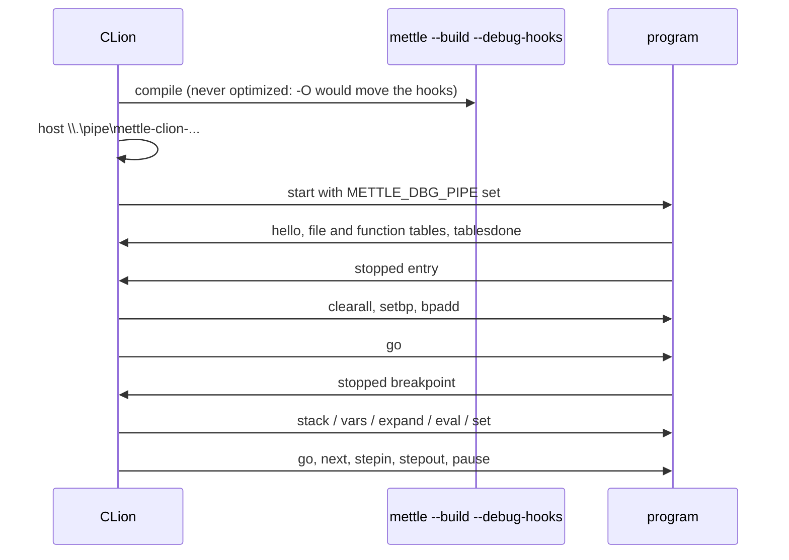

# Mettle for CLion

A JetBrains plugin that makes `.mettle` files first-class in CLion: syntax and semantic
highlighting, navigation, completion, compiler-backed diagnostics, run configurations, and an
interactive source-level debugger driven by the compiler's own `--debug-hooks` runtime.

It is written against long-lived IntelliJ Platform API only, so the same build also loads in
IntelliJ IDEA, Rider, PyCharm and the rest of the family. CLion is the target because that is
where a systems language belongs.

## What you get

| | |
|--|--|
| **Language** | Lexer, parser and PSI for the whole language: declarations, generics, traits and impls, closures and lambdas, GPU kernels and `dispatch`, aggregate literals, `match`, labelled loops, inline `asm`. Semicolons are optional at end of line, exactly as the compiler's parser has it. |
| **Editing** | Brace matching, quote handling, code folding, a formatter, TODO and comment support, live templates (`fn`, `main`, `st`, `forr`, `fori`, `wh`, `sw`, `v`, `ext`, `test`, `kern`), rename refactoring, Find Usages, Structure view, Go to Symbol. |
| **Navigation** | Ctrl-click resolves locals, parameters, functions, globals, constants, enum variants, struct fields and methods, type names and type parameters. Field access resolves through the receiver's declared type, including pointers and arrays. `import "std/io"` jumps to the module, resolved the way the compiler resolves it. |
| **Completion** | Members after `.` and `->`, visible declarations, keywords, built-in types, GPU built-ins, decorators after `@`, and module paths inside `import "..."`. |
| **Diagnostics** | The real compiler runs with `--error-format=json` and its findings appear in the editor with their code, label, `help:` suggestion and related notes. Covers E0001-E0007 and the memory-safety findings M0101-M0112. |
| **Run** | Build and run, build only, run `@test` functions, or print the `--explain` optimization report. Gutter run markers on `main` and on `@test` functions. Every `file.mettle:line:col` in the console is a link, including runtime crash tracebacks. |
| **Debug** | Breakpoints (conditional too), step in/over/out, pause, the call stack, and live variables you can expand and edit. Windows only, because that is where the runtime's transport is implemented. |
| **Optimization report** | A tool window over `--explain-json`: every loop and call the optimizer decided something about, what changed since the last build, backend coverage, and one-click application of the fixes the compiler verified. End-of-line hints and gutter icons put the same verdicts in the editor. |

## Requirements

- CLion 2025.1 or newer (build 251+). Any IntelliJ Platform IDE of that vintage works.
- A `mettle` executable. The plugin looks at the configured path, then `bin/mettle.exe` walking up
  from the source file, then `PATH` - the same search the VS Code extension does, so both agree on
  which compiler a project uses.
- JDK 21 or newer to build the plugin.

## Build and install

```bash
cd tools/clion-plugin
./gradlew buildPlugin
```

That downloads the CLion distribution it compiles against. If you already have CLion installed,
point the build at it instead and skip the download:

```bash
./gradlew buildPlugin -PplatformLocalPath="C:/Program Files/JetBrains/CLion 2026.1.4"
```

The plugin lands in `build/distributions/mettle-clion-<version>.zip`. Install it with
**Settings | Plugins | gear icon | Install Plugin from Disk...** and restart the IDE.

To try it without installing, `./gradlew runIde` starts a sandbox IDE with the plugin loaded.

`gradle.properties` holds the knobs: `platformVersion`, `platformLocalPath`, `pluginSinceBuild`,
`pluginVersion`.

## Configure the toolchain

**Settings | Languages & Frameworks | Mettle**

| Setting | Meaning |
|--|--|
| Compiler | Path to `mettle`. Empty means auto-detect, and the page shows what that currently finds. |
| Stdlib root | Passed as `--stdlib`. Empty means the compiler's own bundled stdlib. |
| Include directories | Passed as `-I`, one per line, relative paths resolve from the project root. |
| Run the compiler for diagnostics | Turn the compiler-backed diagnostics on or off. |
| Diagnostics timeout | How long one diagnostics run may take before it is abandoned. |
| Extra diagnostics arguments | Anything else the diagnostics run should pass, for example `--native-heap`. |

## Diagnostics

The compiler reads from disk, so a run reflects the file as saved. Rather than write your editor
buffer somewhere behind your back, an edited file keeps showing the last run's findings until you
save; the plugin's own parser keeps reporting syntax errors live in the meantime. This mirrors how
the VS Code extension behaves, so a project sees the same diagnostics in both editors.

Diagnostics reported against imported modules are dropped, matching the compiler's own rule that
warnings are scoped to the main compile unit.

## Run configurations

Right-click a `.mettle` file, or use the gutter marker on `main`, to create a configuration.

| Action | What it runs |
|--|--|
| Build and run | `mettle <file> -o <exe> --build [--release]`, then the executable. Compiler output, including warnings, is printed above the program's own output. |
| Build only | The same compile, with the compiler as the console process. |
| Run `@test` functions | `mettle test <file>`, in the compiler's IR interpreter. |
| Optimization report | `mettle -i <file> --release --explain`. |

The output executable defaults to `<stem>.exe` next to the source; set **Output executable** to put
it elsewhere. **Extra compiler arguments** are appended to the compile, **Program arguments** to the
run.

## The optimization report

**View | Tool Windows | Mettle Optimization**, or `Ctrl+Alt+Shift+E` on a Mettle file, or
**Optimization Report** in the editor's context menu.

It compiles the file with `--release --explain-json` and reads the sidecar, so everything shown is
the compiler's own verdict, never the plugin's guess. The schema is documented in
[docs/explain-json.md](../../docs/explain-json.md).

- **Summary strip** - loops vectorized against scalar, calls inlined against refused, verified
  fixes, backend coverage, what the whole pipeline removed, the heaviest decision in the file, and
  whether anything regressed since the last build.
- **Changes since the last build**, regressions first. Each build leaves its baseline next to the
  output, so the second and later reports say what moved. This is the reason to keep the tool
  window open while tuning: you see a regression the moment you cause it.
- **Loops and calls**, grouped by function and ranked within it by modelled cost rather than line
  order, with the one-line stdlib inlines collapsed into a single "routine inlines" row instead of
  burying the real decisions. Loop rows carry what the backend measured (`7.20 cycles/iter on p23`);
  selecting one shows the reason, the suggested fix, and the `verified:` line where the compiler
  applied that fix to a clone, re-ran its own optimizer, and reported what the loop became.
- **Functions** - what the pipeline achieved on each one (`378 -> 131 instructions`), loops
  vectorized, spills, and whether it reached the register-allocating backend.
- **Optimizer passes** - every pass that ran on this file, how often it changed anything, and the
  instructions it removed. A pass that ran forty times and never fired is as informative as the one
  that halved the function.
- **Call graph** - caller/callee edges with sites inlined, sites left as calls, and callee weight.
- **Backend coverage** - which functions missed the register-allocating backend, grouped by cause,
  with the consequence and the fix per group.
- **Memory report** - the compile-time memory findings for the same file.
- Double-click any row to jump to the line.

### One-click verified fixes

Where the compiler proved a fix works, the panel offers to make the edit, and so does `Alt+Enter`
on the line and the gutter icon next to it:

| The compiler says | The plugin does |
|--|--|
| `declare the accumulator \`s\` as int64` | Resolves `s` from the loop's scope and widens its declared type. |
| `declare the accumulator as int64 (sum bytes as ...)` | Finds the accumulator in the loop, widens it, and widens the `(int32)` cast in the accumulation to `(int64)` - both, because the byte kernel needs both. |
| `remove \`@noinline\` from \`damp\`` | Deletes that decorator from the callee, wherever it is declared. |
| `make \`scale\` inline-eligible ... mark it @inline` | Adds `@inline` to the callee, unless it already carries an inlining decorator. |

The edits come from the syntax tree, not from a text search: the accumulator is the one the name
actually resolves to in that scope, and the callee is the declaration the call resolves to. The fix
family is chosen by the compiler's own diagnosis id (`int32-sum-narrow-acc`, `byte-sum-narrow-acc`,
`call-in-body`), so rewording a message cannot break the button. Advice the compiler did not
verify, and advice with nothing mechanical behind it ("use int32 elements"), is shown but never
offered as a button.

**Apply all verified fixes** runs the lot as a single undoable command, re-deriving each edit after
the previous one so offsets cannot go stale.

### In the editor

- **End-of-line hints** on every loop and call line: `→ vfmadd231ps, 8-wide float32 affine map`, or
  `not vectorized: <the reason, trimmed>`. Toggle them from the tool window toolbar.
- **Gutter icons** on refusals: hover for the full reason, fix and verification; click to apply.
- **Refresh on save** recompiles the report when you save a file that already has one, so the
  hints track the code as you edit it.

## Debugging

Debug is available on the **Build and run** action, on Windows. It does not use GDB or LLDB: the
compiler ships an interactive debug runtime (`--debug-hooks`) that talks a line protocol over a
named pipe, and this plugin is the adapter on the other end. Variables are read and written through
the live pointers the instrumentation registered, so **Set Value** in the Variables pane genuinely
changes the running program's state.



Notes worth knowing:

- The debug build is always unoptimized. The optimizer would move or delete the instrumentation
  hooks, so `--release` is not applied to it.
- Breakpoints only bind on lines the compiler instrumented, which is to say statement lines of the
  program being debugged. A breakpoint in a file that is not part of this program is marked invalid.
- The debugger stops on hardware faults - access violations, division by zero, illegal instructions
  - at the faulting source line, with the stack and every variable still inspectable.
- **Evaluate** and **Set Value** accept variable paths such as `box.min.x` or `grid[2]`. The runtime
  resolves paths against its live pointers; it is not an expression interpreter, and anything else
  is rejected rather than silently answered with something wrong.
- Breakpoint conditions use the runtime's grammar: `<path> <op> <literal>`, with `op` one of
  `== != < <= > >=`.
- Run to cursor is not supported; the runtime has no such command.
- On Linux the debug hooks compile to no-ops, so the Debug action is not offered there.

## Development

```bash
./gradlew test          # 41 tests
./gradlew buildPlugin
./gradlew runIde
```

Three of those tests are worth knowing about:

- **The corpus test** parses every `.mettle` file in `stdlib/`, `examples/` and `tests/` - 583
  sources at the time of writing, excluding the compiler's deliberately-malformed negative
  fixtures - and fails if any of them produces a parse error. It is the reason the grammar covers
  closures, `where` clauses, namespaced imports, nested generics and optional semicolons: the
  corpus found each gap.
- **The debug protocol test** compiles `tests/debug_demo.mettle` with `--debug-hooks`, hosts the
  pipe, runs the program, sets a breakpoint, reads the stack and the locals, resolves
  `corner.x` / `box.max.y` / `pp->y` / `grid[2]`, writes a variable back through its live pointer,
  and lets the program run to a clean exit. It skips itself off Windows or without a compiler.
- **The explain test** compiles `tests/explain_demo.mettle` with `--explain-json` and parses the
  real sidecar, then synthesizes each fix family against a real syntax tree and checks the text it
  would produce. If the compiler ever rewords a `fix:` line, this is what notices.

```
src/main/java/org/mettle/clion/
  lang/          lexer, parser, token and element types, file type
  psi/           PSI elements, references, name resolution, import resolution
  highlight/     syntax highlighter, semantic annotator, colour settings page
  editor/        folding, formatting, structure view, completion, documentation, templates
  diagnostics/   the --error-format=json external annotator
  explain/       the --explain-json model, tool window, editor hints and verified fixes
  run/           run configuration, build command lines, console filter, gutter markers
  debug/         the --debug-hooks named-pipe adapter and XDebugger integration
  settings/      project settings and toolchain discovery
```

## Limitations

- Diagnostics refresh on save, not on every keystroke (see above).
- Resolution is file-and-imports based, not indexed. Go to Symbol scans the project's Mettle files
  rather than using a stub index, which is fine for projects of this size but is not free on very
  large trees.
- Namespaced imports (`import "m" as alias`) resolve the type and value names, but the alias itself
  is not a navigable symbol.
- The formatter handles indentation and spacing. It does not wrap long lines or align columns.
- Debugging is Windows only, following the runtime.
- The optimization report is per file, the unit the compiler's `--explain` works in. It reports on
  the file you point it at, not on a whole project at once.
- Four fix families are mechanical enough to apply. Everything else the compiler suggests is shown
  as text, deliberately.
